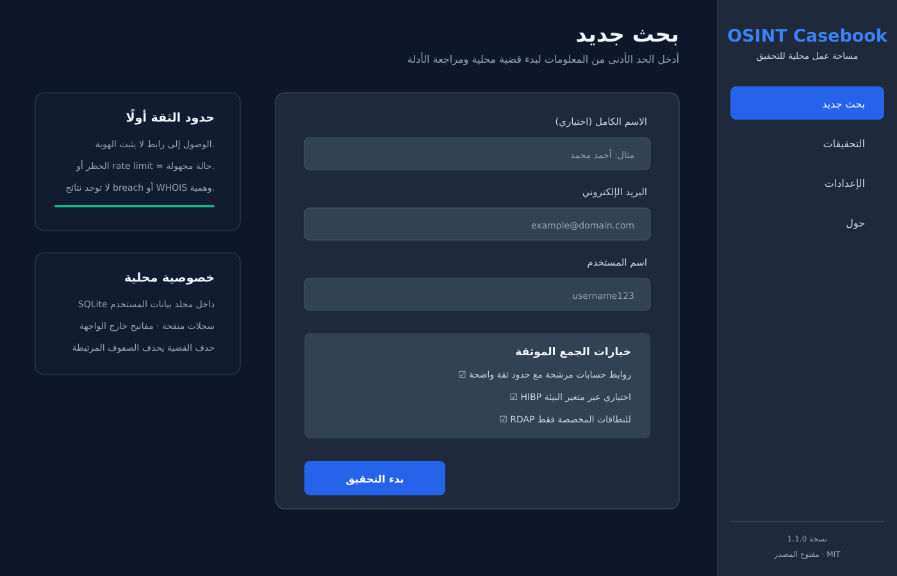

# OSINT Casebook

A local-first Electron workspace for authorized OSINT case notes, evidence-backed provider checks, and manual review. It is a desktop companion to [OSINT-Roadmap](https://github.com/imedkablavi/OSINT-Roadmap), not another tool catalog or learning site.



> Rendered preview of the current UI using synthetic placeholders; it contains no investigation data.

## Why this repository remains separate

`OSINT-Roadmap` owns learning paths, multilingual reference content, the browser Tool Finder, and maintained resource links. OSINT Casebook owns the local desktop workflow: SQLite cases, provider requests, candidate evidence, redacted logs, and relationship views. The evidence and removal decisions are documented in [the architecture/overlap report](docs/ARCHITECTURE-OVERLAP.md).

## Current, verified scope

- Local SQLite case storage under Electron's per-user data directory.
- Public profile URL checks stored as **candidates**, never identity attribution.
- Optional Have I Been Pwned account/paste queries when `HIBP_API_KEY` is configured.
- RDAP lookup for custom email domains; common public mail domains are skipped.
- Relationship view and confidence labels designed for manual review.
- Redacted provider/application logs and explicit case deletion.
- Isolated Electron renderer (`contextIsolation`, sandbox, preload allowlist, CSP).
- Windows NSIS/portable and Linux AppImage/deb packaging definitions.

The application does not claim that a reachable profile belongs to a target. Provider blocks and rate limits are classified as unknown. It does not generate simulated breach or WHOIS results.

## Quick start

Requirements: Node.js 22.5+ and npm (`node:sqlite` is required).

```bash
npm ci
npm test
npm start
```

Optional HIBP integration:

```bash
HIBP_API_KEY="your-key" npm start
```

`.env.example` contains names and empty placeholders only. The app does not package or automatically read `.env` files.

## Quality and packaging

```bash
npm run lint
npm test
npm run build
npm run package:smoke

# Native distributables
npm run package:linux
npm run package:win
```

Windows packages must be produced on Windows; Linux packages must be produced on Linux. GitHub Actions runs install/test checks on both and performs native packaging smoke jobs. See [release/versioning](docs/RELEASE.md).

## Architecture

```text
Renderer (no Node.js)
        │ explicit preload API
        ▼
Electron main ── validation/redaction ── SQLite case store
        │
        └── bounded HTTP client ── profile providers / HIBP / RDAP
```

The network client enforces bounded timeouts, limited retries, response-size limits, and rejects credential-bearing or local/private literal endpoints. Provider errors returned to the UI are generic; operational logs are redacted.

## Privacy and security

Read [PRIVACY.md](docs/PRIVACY.md) before using real investigation data and [SECURITY.md](SECURITY.md) before reporting a vulnerability. In particular:

- Do not commit databases, logs, exports, screenshots of real cases, or API keys.
- Use only data you are authorized to process.
- Treat every candidate as unverified until independently corroborated.
- Deleting a case removes its related rows; backups of the user-data directory remain the user's responsibility.
- The database is not application-level encrypted; use OS account controls and full-disk encryption for data at rest.

## Development

The runnable project is at the repository root. Tests use Node's built-in test runner and synthetic provider responses—CI does not depend on live OSINT providers. See [CONTRIBUTING.md](CONTRIBUTING.md).

## License

MIT. See [LICENSE](LICENSE).
